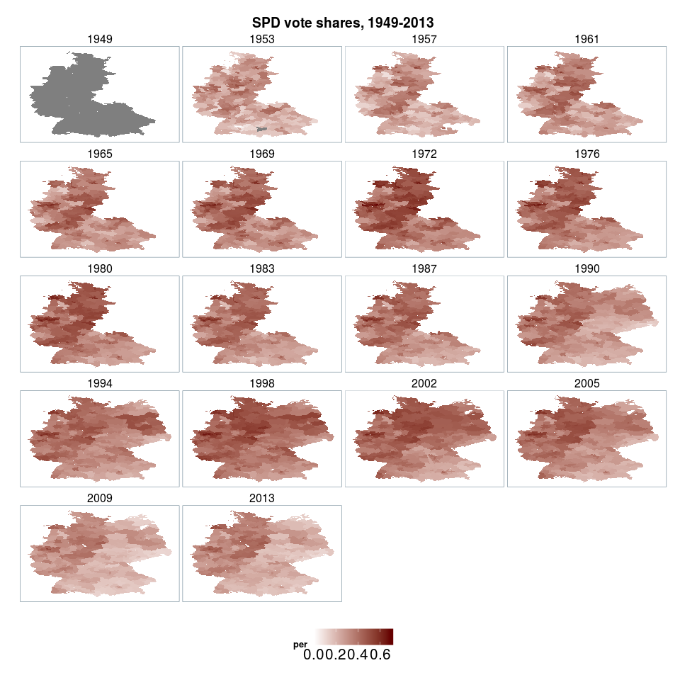

# About
This R package contains data sets on German parliamentary elections, from 1949 to 2013. It comprises five separate data sets: 

- Electoral results, including candidate and party votes (*btw_votes*)
- Candidate information (*btw_candidates*)
- District information
  1. Information about the geographical closeness of electoral districts (*btw_districts_neighbors*)
  2. Information about structural characteristics of electoral districts (*btw_districts*)
  2. District maps in polygon format (*btw_districts_maps*)

Comma-separated/JSON files can be downloaded from here.

# Installation & Usage
The package can be installed from this Github repository:


```r
#install.packages("devtools")
devtools::install_github("crubba/bundestagswahl")
```

To access the data in R type:


```r
library("bundestagswahl")

data("btw_votes")
data("btw_candidates")
data("btw_districts_neighbors")
data("btw_districts")
data("btw_districts_maps")
```

## Example

```r
library("dplyr")
library("ggplot2")

districts1987 <- subset(btw_districts_maps, year == 1987)
btw_votes_spd <- filter(btw_votes, party == "SPD", year == 1987, mandate == "pvote") %>%
  select(., year, wk,  per)

gg_df <- left_join(districts1987, btw_votes_spd, 
                   by = c("year" = "year", "wk" = "wk"))
gg_df$groupid <- paste(gg_df$wk, gg_df$part)

ggplot(data = gg_df, aes(x = long, y = lat, group = groupid, fill = per)) + 
  geom_polygon(colour = "white", size = 0.1) + 
  scale_fill_gradient(low = "white", high = "#660000") +
  ggtitle("Party vote shares for SPD in 1987") +
  xlab("") + ylab("") +
  theme(legend.text = element_text(size = 8),
        panel.border = element_blank(),
        panel.background = element_rect(fill = "#8DB6CD", colour = NA),
        legend.key = element_rect(fill = "white"),
        legend.box = "horizontal",
        legend.position = "bottom",
        axis.text = element_text(size = rel(0.8)),
        axis.text.y = element_blank(),
        axis.text.x = element_blank(),
        axis.title = element_blank(),
        axis.ticks = element_blank(),
        panel.grid.major = element_blank(),
        panel.grid.minor = element_blank())
```

 

# Citation
If you use the datasets provided through this package, please consider citing it. To receive citing information type:


```r
citation("bundestagswahl")
```


